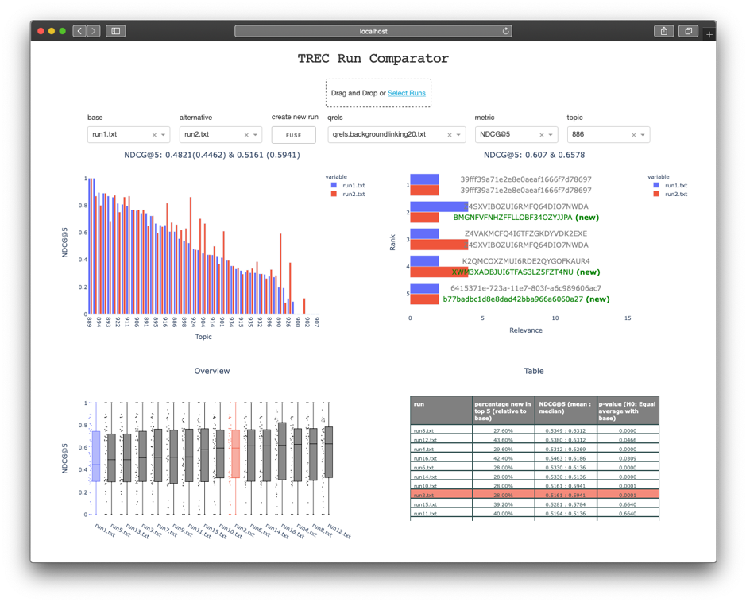

# TREC Run Comparator
<p>
<a href="https://github.com/psf/black"></a>
</p>
Interactive dashboard for comparison of TREC runs for the **background-linking** task in TREC News.



## Docker 
Build image via:
```
docker build . -t run-comparator
```

Mount folder with your runs and qrels and run comparator via:
```
docker run -d -v $PWD/qrels:/code/qrels -v $PWD/runs:/code/runs -p 8050:8050 run-comparator
```

The dashboard is available on [localhost:8050](http://localhost:8050/)

## Features
Comparison of two TREC runs: base and alternative. Runs can placed in the mounted folder or inside Drag & Drop menu. A specific run can be selected using the dropdown menus. New documents that are placed in the top ranking of the alternative run are marked green.

The dashboard shows:

- Comparison of NDCG@(5/10) per individual topic.
- Comparison of relevance for documents in top (5/10).
- Overview of all runs in /runs folder.
- Overview table: percentage of new docs found in the top (5/10) compared to the base run, NDCG@(5/10) mean and median, and the p-value (compared to base).


The p-value is calculated using a two-sided t-test for [related samples](https://docs.scipy.org/doc/scipy/reference/generated/scipy.stats.ttest_rel.html).

You can use the `FUSE` button to generate a new run by combining the base and alternative run (reciprocal rank fusion).
